# AI + Watchdog Cooperation — Full Technical Documentation

> How the rule-based monitors, the AI Analyser, and the hardware watchdog
> work **together** to detect, escalate, and respond to threats on the
> Raspberry Pi 4 gateway.

---

## 1 — The Big Picture

Two independently operating layers guard the gateway simultaneously.
They share data through the structured log, but they **never block each other**.

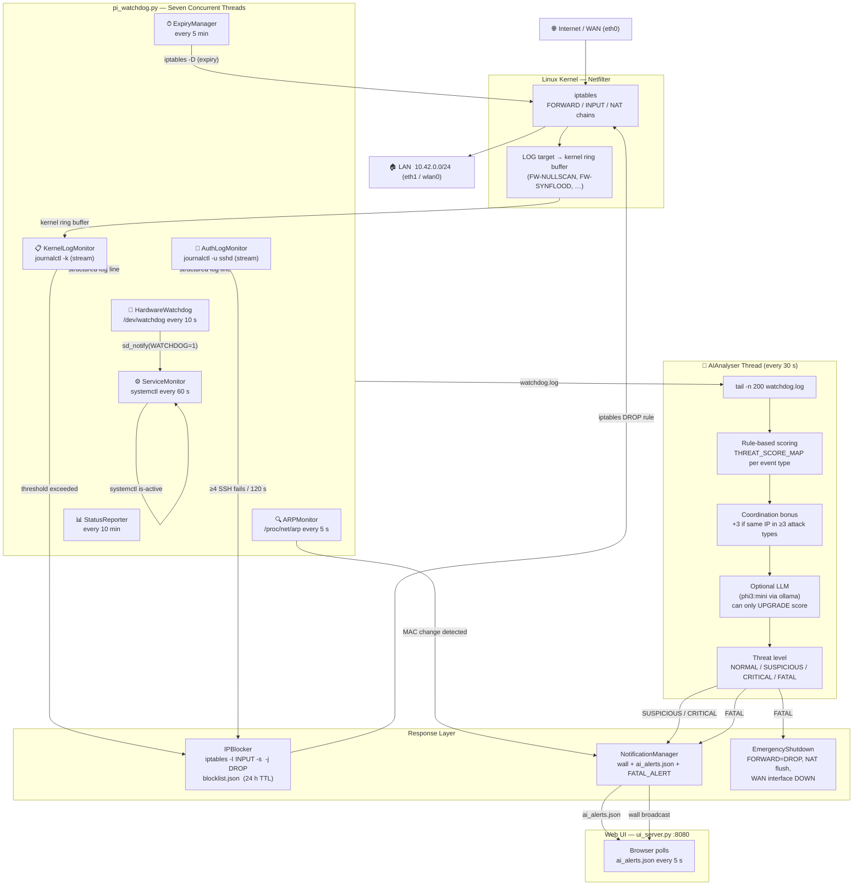

---

## 2 — Two Distinct Defence Layers

| | Rule-based Monitors | AI Analyser |
|---|---|---|
| **Speed** | Real-time stream (milliseconds) | Cycle-based (every 30 s) |
| **Scope** | One attack type at a time | Cross-type correlation |
| **Trigger** | Threshold count per type | Cumulative threat score |
| **Output** | `iptables DROP` for offending IP | Threat level → notify / shutdown |
| **Can escalate to FATAL?** | No | Yes |
| **LLM involvement** | No | Optional (ollama) |

The **rule-based layer** is the first responder — it slams the door the moment
a scan or brute-force attack crosses a numeric threshold.

The **AI layer** is the investigator — it reads the compiled log, looks for
coordinated multi-vector attacks across all events, and can trigger an
**emergency lockdown** that no individual monitor can trigger on its own.

---

## 3 — Rule-Based Monitoring (Immediate Response)

### 3a — Kernel Log Monitor

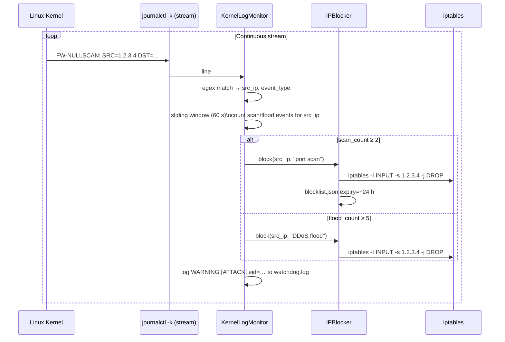

**Scan types detected:** `FW-NULLSCAN`, `FW-XMASSCAN`, `FW-FINSCAN`, `FW-SYNRST`, `FW-FRAGMENT`, `FW-INVALID`

**Flood types detected:** `FW-SYNFLOOD`, `FW-ICMPFLOOD`, `FW-UDPFLOOD`, `FW-CONNRATE`, `FW-CONNLIMIT`, `FW-FWDRATE`

---

### 3b — SSH Auth Monitor

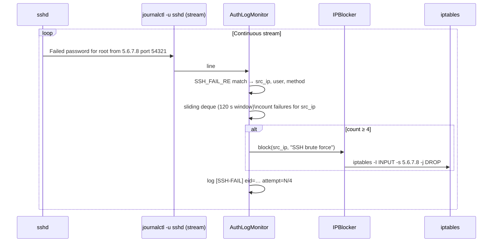

---

### 3c — ARP Monitor (Cable MITM Detection)

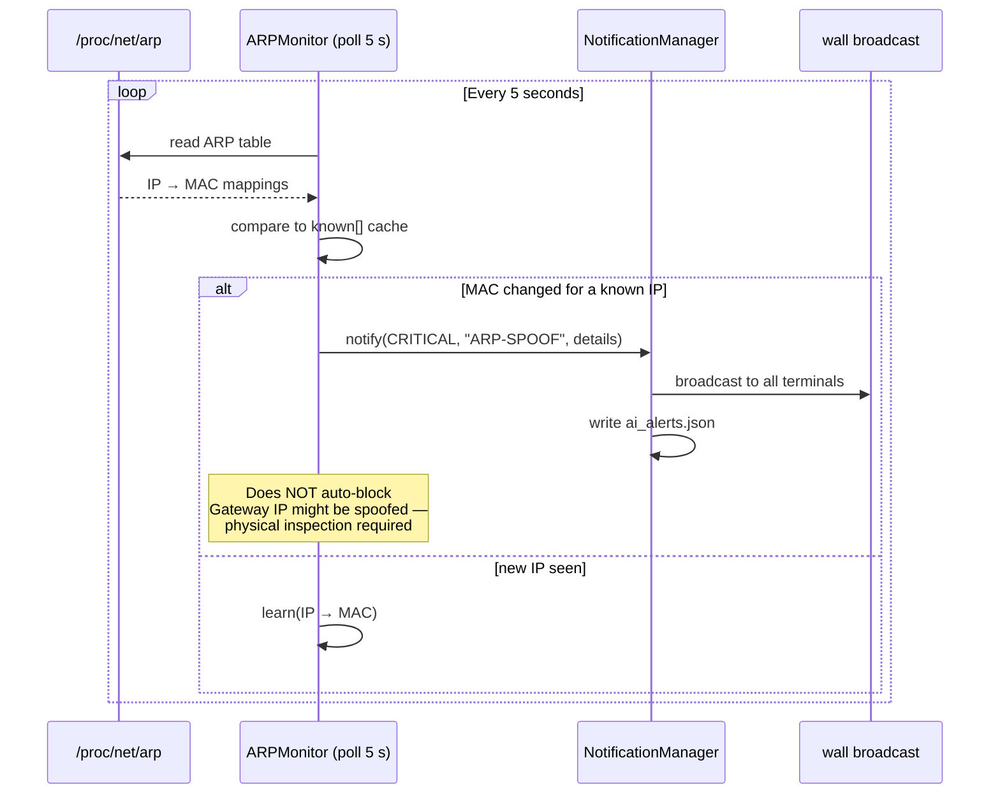

---

## 4 — AI Analyser: The Threat Correlation Engine

The AI Analyser runs as a **separate daemon thread** with a 30-second polling cycle.
It does NOT block IPs directly — it observes the log, computes a holistic threat score,
and escalates to the notification / emergency shutdown pipeline.

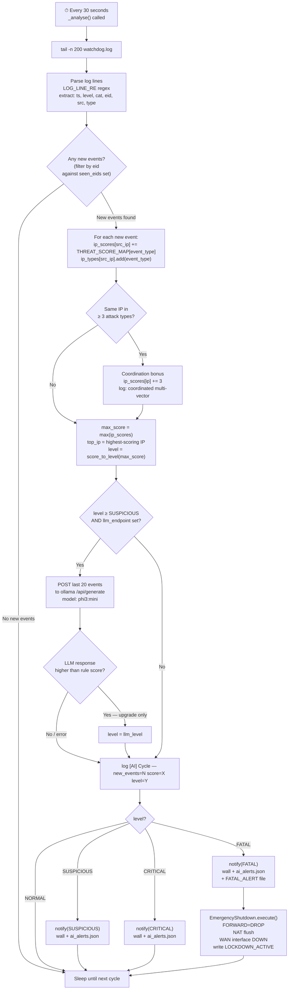

---

## 5 — Threat Score Table

Every event type the watchdog logs is mapped to a numeric score.
The AI Analyser sums these scores per attacker IP in each 30-second cycle.

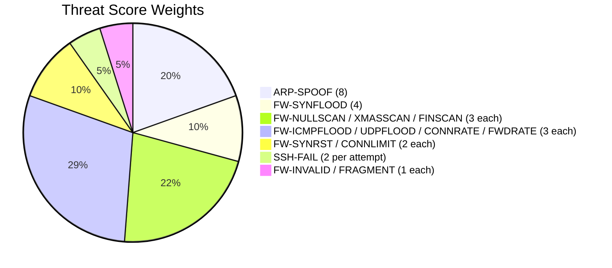

| Score Range | Threat Level | Action |
|---|---|---|
| 0 – 2 | `NORMAL` | Log only |
| 3 – 5 | `SUSPICIOUS` | Notify via wall + web UI |
| 6 – 9 | `CRITICAL` | Notify via wall + web UI |
| ≥ 10 | `FATAL` | Notify **+** Emergency lockdown |

**Coordination bonus:** if a single IP appears in 3 or more distinct attack
categories in the same cycle, `+3` is added to its score.
This catches sophisticated attackers who combine scans, floods, and SSH probing.

---

## 6 — Optional LLM Integration (ollama)

When `--llm-endpoint http://localhost:11434` is set, the AI Analyser sends the
last 20 log events to a local language model whenever the rule-based score
reaches SUSPICIOUS or above.

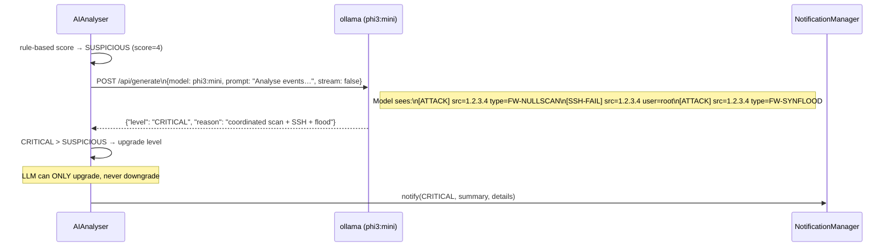

**The LLM receives a strict prompt:**
```
You are a network security analyst on a Raspberry Pi gateway.
Analyse the log events below and classify the OVERALL threat level
as exactly one of: NORMAL, SUSPICIOUS, CRITICAL, FATAL.
Reply with valid JSON only: {"level": "CRITICAL", "reason": "..."}
```

If the endpoint is unreachable or returns garbage JSON, the system falls back
silently to the rule-based score — **no alert is missed**.

---

## 7 — Hardware Watchdog Integration

The software watchdog (Python) and the hardware watchdog (/dev/watchdog) operate
in a nested safety net.

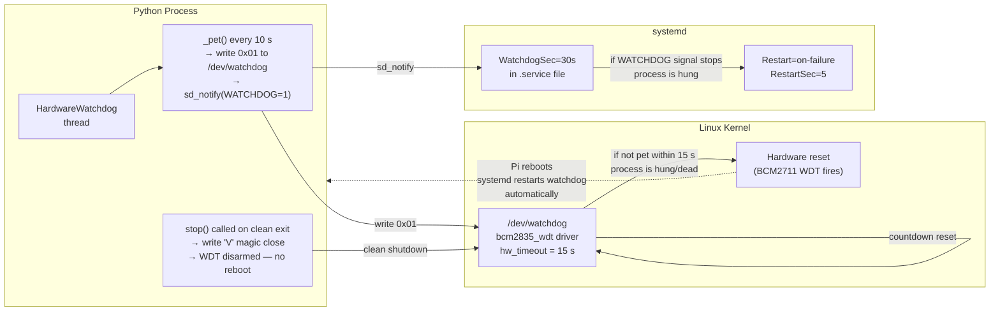

**The nested safety net:**

1. Python `HardwareWatchdog` writes to `/dev/watchdog` every 10 s (< 15 s HW timeout)
2. `sd_notify("WATCHDOG=1")` satisfies systemd's `WatchdogSec=30s`
3. If **Python hangs** → hardware WDT fires at 15 s → Pi hard-reboots
4. If **Python crashes** → systemd restarts the service in 5 s
5. If **Python exits cleanly** → magic `'V'` written → WDT disarmed → no reboot

---

## 8 — Emergency Shutdown Sequence (FATAL Path)

This is the most drastic response, triggered **only** when the AI Analyser
determines the threat level reaches FATAL (score ≥ 10).

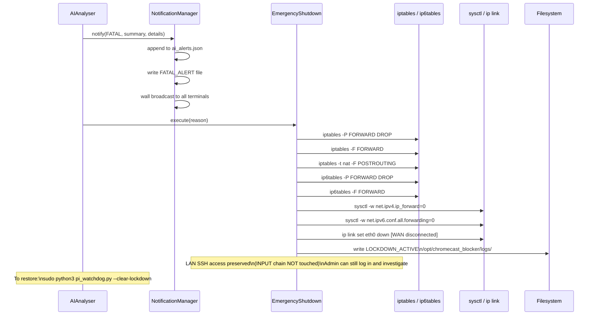

---

## 9 — Notification Pipeline

Every alert generated by the AI Analyser travels through three simultaneous channels:

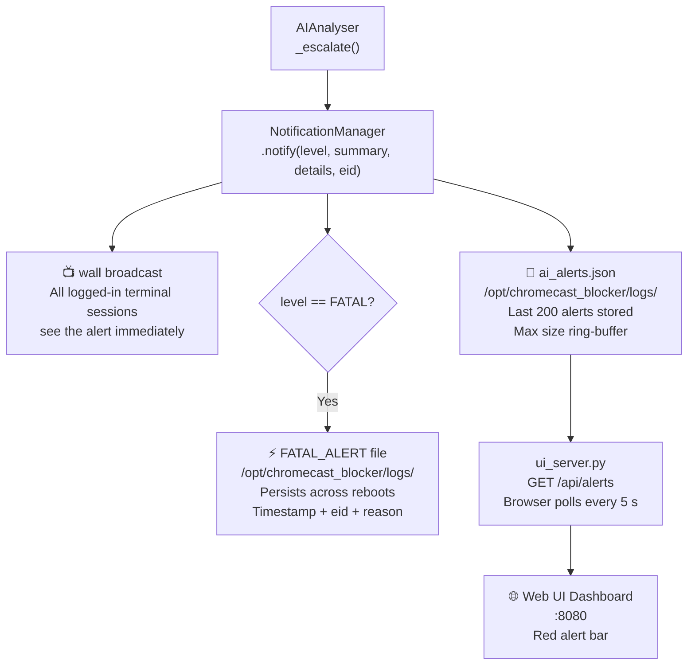

---

## 10 — Full Thread Map (pi_watchdog.py)

```mermaid
gantt
    title Polling intervals of all watchdog threads (not to scale)
    dateFormat X
    axisFormat %s s

    section HardwareWatchdog
    pet /dev/watchdog          : 0, 10
    pet /dev/watchdog          : 10, 20
    pet /dev/watchdog          : 20, 30

    section ARPMonitor
    poll /proc/net/arp         : 0, 5
    poll /proc/net/arp         : 5, 10
    poll /proc/net/arp         : 10, 15
    poll /proc/net/arp         : 15, 20
    poll /proc/net/arp         : 20, 25
    poll /proc/net/arp         : 25, 30

    section KernelLogMonitor
    stream (continuous)        : 0, 30

    section AuthLogMonitor
    stream (continuous)        : 0, 30

    section AIAnalyser
    analysis cycle             : 0, 30

    section ServiceMonitor
    systemctl is-active        : 0, 30

    section ExpiryManager
    expire blocks (300 s)      : milestone, 0, 0

    section StatusReporter
    log status (600 s)         : milestone, 0, 0
```

---

## 11 — Data Flow: From Attack to Block

This is the complete end-to-end journey of a typical port scan attack:

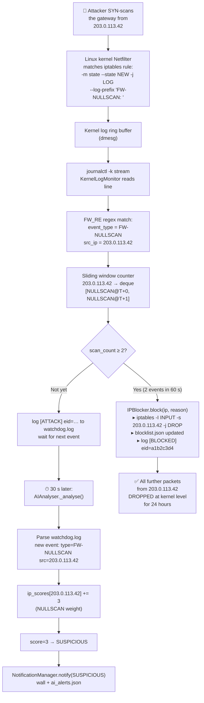

---

## 12 — Multi-Vector Attack: AI Coordination Detection

This scenario shows **why the AI layer exists** — a sophisticated attacker
using multiple techniques simultaneously that no single monitor would escalate alone:

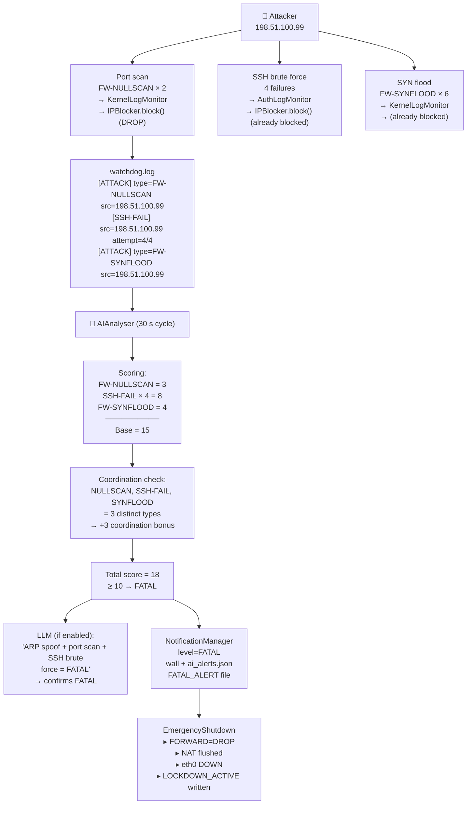

In this scenario:
- The **rule-based monitors** correctly block the IP immediately
- The **AI layer** recognises the coordinated nature (3 attack vectors, score 18) and **escalates to FATAL**
- The gateway **disconnects from the internet entirely** to protect all LAN clients

---

## 13 — Service Health Self-Monitoring

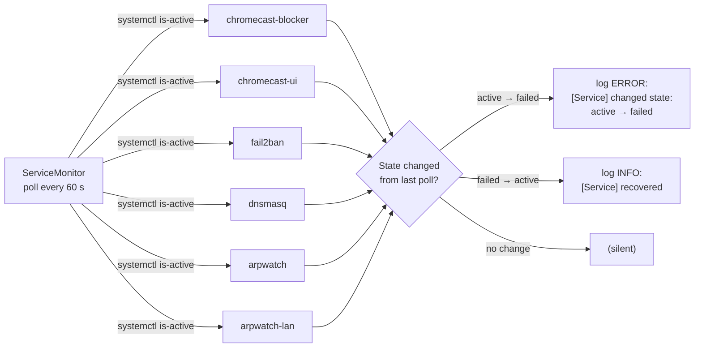

---

## 14 — Block Lifecycle

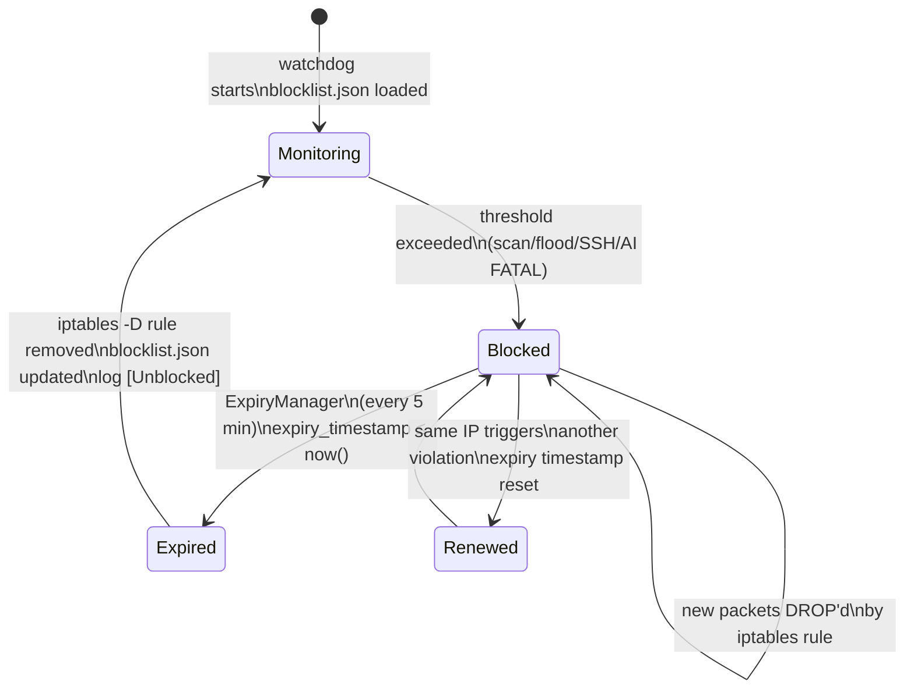

**Block TTL:** 24 hours by default (`--block-expire 86400`).
Blocks survive restarts (persisted to `blocklist.json`).

---

## 15 — Lockdown Recovery Procedure

If a FATAL threat triggers `EmergencyShutdown`, the Pi disconnects from the internet.
To restore:

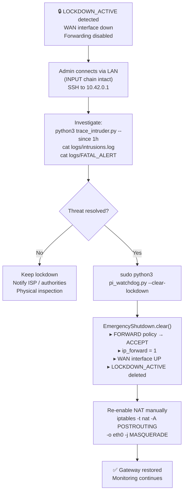

---

## Summary

```
┌─────────────────────────────────────────────────────────────────────┐
│                     DEFENCE IN DEPTH                                │
│                                                                     │
│  Layer 1 (instant):   iptables rules (set by chromecast_blocker)   │
│  ─ DROP packets from known bad IPs / ports / protocols             │
│                                                                     │
│  Layer 2 (real-time): Rule-based monitors (KernelLog, AuthLog, ARP)│
│  ─ Count events per IP in a sliding window                         │
│  ─ Block the IP in iptables the moment threshold is crossed        │
│                                                                     │
│  Layer 3 (30 s):      AI Analyser                                  │
│  ─ Reads compiled log, scores events, detects coordinated attacks  │
│  ─ Optional LLM upgrade (phi3:mini via ollama)                     │
│  ─ Escalates to FATAL → EmergencyShutdown (WAN disconnect)        │
│                                                                     │
│  Layer 4 (15 s / HW): Hardware Watchdog (/dev/watchdog)           │
│  ─ If the Python process hangs → Pi hard-reboots automatically     │
│                                                                     │
│  All four layers operate concurrently in separate threads.         │
│  No single point of failure. No single decision-maker.             │
└─────────────────────────────────────────────────────────────────────┘
```
