# Linux Networking Internals
## History, Architecture & How This Project Fits

> *"If you can't draw your thoughts, you haven't understood."*

This document explains the evolution of Linux networking from the 1990s to today,
and shows precisely where every component of this Chromecast privacy gateway sits
within that stack. Each concept is anchored to a diagram.

---

## Table of Contents

1. [The Full Stack — One View](#1-the-full-stack--one-view)
2. [Stone Age: SysV init & ifupdown (pre-2004)](#2-stone-age-sysv-init--ifupdown-pre-2004)
3. [The Kernel Never Changed — Netlink is Eternal](#3-the-kernel-never-changed--netlink-is-eternal)
4. [Netfilter: Packet Hooks in the Kernel](#4-netfilter-packet-hooks-in-the-kernel)
5. [NetworkManager: The Laptop Revolution (2004)](#5-networkmanager-the-laptop-revolution-2004)
6. [D-Bus: The Glue Nobody Talks About](#6-d-bus-the-glue-nobody-talks-about)
7. [systemd: The Great Unifier (2010)](#7-systemd-the-great-unifier-2010)
8. [systemd-networkd: The Leaner Alternative](#8-systemd-networkd-the-leaner-alternative)
9. [Raspberry Pi OS: Which Stack Are You On?](#9-raspberry-pi-os-which-stack-are-you-on)
10. [Boot Sequence: From Power-On to Protected](#10-boot-sequence-from-power-on-to-protected)
11. [mDNS, SSDP, Cast: Why Chromecast Is a Threat](#11-mdns-ssdp-cast-why-chromecast-is-a-threat)
12. [Historical Timeline](#12-historical-timeline)

---

## 1. The Full Stack — One View

Every packet that Chromecast tries to send to Google travels through all of these layers.
Our blocker sits at the **Firewall layer** and drops the packet before it ever leaves the Pi.

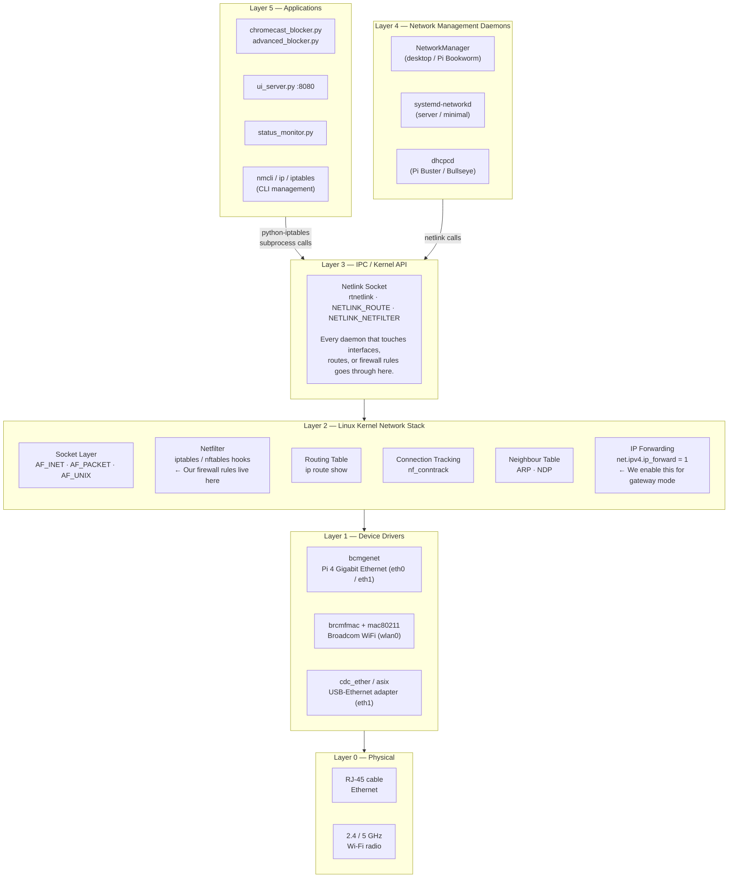

> **Key insight:** Every user-space tool — `nmcli`, `ip route add`, `iptables -A`, our Python
> scripts — all funnel through the **netlink socket API** to reach the kernel. There is no other
> path. The kernel has not fundamentally changed; only the user-space wrappers around it have evolved.

---

## 2. Stone Age: SysV init & ifupdown (pre-2004)

### The problem that started everything

Early Linux had no "network manager". Network state was configured by shell scripts that ran
at boot. Changing WiFi networks on a laptop meant editing a text file and rebooting — or at
best running `ifdown wlan0 && ifup wlan0` by hand.

### Debian — `/etc/network/interfaces` + `ifupdown`

```
/etc/network/interfaces
────────────────────────────────────────────────────
auto eth0
iface eth0 inet dhcp

auto wlan0
iface wlan0 inet static
    address 192.168.1.100
    netmask 255.255.255.0
    gateway 192.168.1.1
    wpa-ssid  MyHomeNetwork
    wpa-psk   s3cr3tp4ssword
────────────────────────────────────────────────────

ifup eth0     →  runs dhclient eth0
ifdown wlan0  →  runs ip link set wlan0 down
```

### Red Hat — `/etc/sysconfig/network-scripts/ifcfg-*`

```
/etc/sysconfig/network-scripts/ifcfg-eth0
────────────────────────────────────────────────────
DEVICE=eth0
BOOTPROTO=dhcp
ONBOOT=yes
TYPE=Ethernet
────────────────────────────────────────────────────
```

### SysV init — Sequential Startup

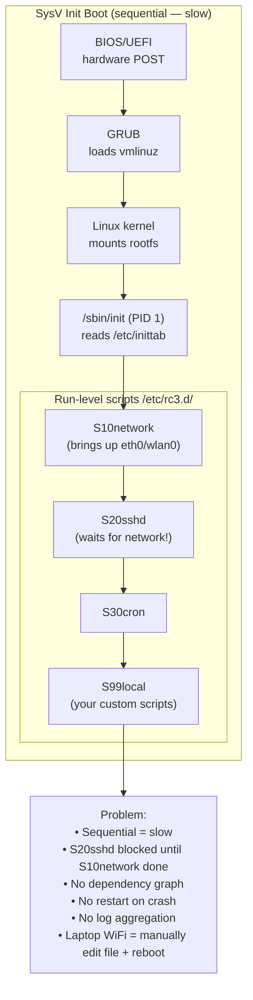

**Why this was painful:**
- Boot took 30–90 seconds (services started one-by-one)
- A single stalled DHCP request blocked everything after it
- No standard way to restart a crashed daemon
- Laptop WiFi roaming was impossible without manual intervention

---

## 3. The Kernel Never Changed — Netlink is Eternal

While user-space tools (ifupdown → NetworkManager → systemd-networkd) have changed
drastically, the **kernel's networking API has been stable since ~2.2 (1999)**.

### Netlink Message Flow

```mermaid
graph LR
    subgraph US["User Space"]
        direction TB
        NM_NL["NetworkManager"]
        IP_CMD["ip addr add 10.42.0.1/24 dev eth1"]
        IPT_CMD["iptables -A FORWARD -j DROP"]
        PY_NL["python-iptables\n(our blocker)"]
    end

    subgraph NL["Netlink Socket  AF_NETLINK"]
        direction TB
        NL1["NETLINK_ROUTE\ninterfaces · addresses · routes · neighbours"]
        NL2["NETLINK_NETFILTER\niptables · nftables · conntrack"]
        NL3["NETLINK_GENERIC\nextensions (WiFi cfg80211, etc.)"]
    end

    subgraph KS["Kernel Space"]
        direction TB
        NET_CORE["net/core\ninterface management"]
        RTABLE["net/ipv4/route.c\nrouting table"]
        NFT["net/netfilter/\niptables · nft hooks"]
    end

    US -- "socket(AF_NETLINK, SOCK_RAW, ...)\nsendmsg / recvmsg" --> NL
    NL --> KS
```

`ip addr add`, `ip route add`, `iptables -A` — these are all just **convenience wrappers**
that format a netlink message and send it over a socket. They have been doing this since 1999.

---

## 4. Netfilter: Packet Hooks in the Kernel

Netfilter was merged into Linux 2.4.0 in January 2001 by Rusty Russell. It defines
five **hook points** where code can inspect, modify, or drop every packet.

### The Five Hook Points & iptables Chains

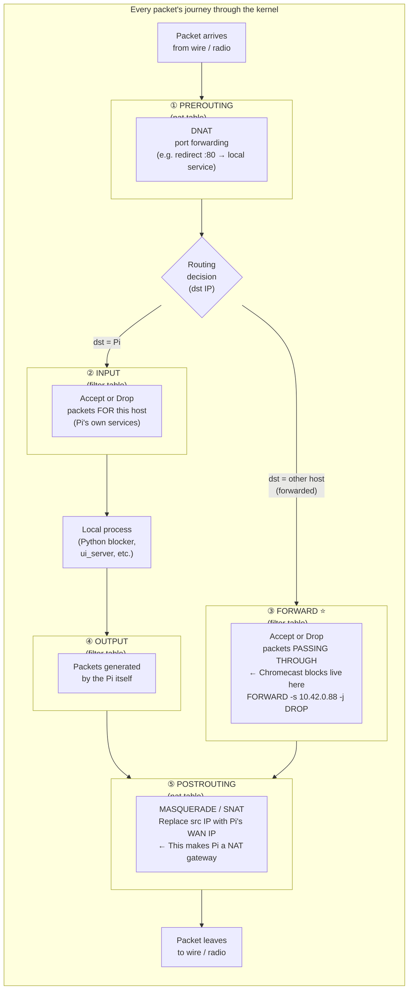

### iptables Tables — Evaluated in Order

```
Every packet passes through up to 4 tables, in this fixed order:

┌──────────┐     ┌──────────┐     ┌──────────┐     ┌──────────┐
│  raw     │ →   │  mangle  │ →   │  nat     │ →   │  filter  │
│          │     │          │     │          │     │          │
│ conntrack│     │ TTL edit │     │ DNAT     │     │ ACCEPT   │
│ bypass   │     │ TOS mark │     │ SNAT     │     │ DROP     │
│          │     │ routing  │     │ MASQUERADE│    │ REJECT   │
│          │     │ mark     │     │          │     │ LOG      │
└──────────┘     └──────────┘     └──────────┘     └──────────┘

This project uses:
  nat    → POSTROUTING  MASQUERADE   (Pi as NAT gateway — LAN → WAN)
  filter → FORWARD      DROP rules   (block Chromecast → internet)
  filter → INPUT        DROP rules   (protect Pi itself)
```

### Rule Evaluation Within a Chain

```
Packet enters FORWARD chain
        │
        ▼
 ┌─────────────────────────────────────┐
 │ Rule 1: -s 10.42.0.88 -d 8.8.8.8   │ ← match? → DROP (Chromecast blocked)
 │ Rule 2: -s 10.42.0.88 -p tcp       │ ← match? → DROP
 │ Rule 3: -i eth1 -o eth0 -m state   │ ← match? → ACCEPT (other devices)
 │   --state ESTABLISHED,RELATED      │
 │ Rule N: ...                        │
 └─────────────────────────────────────┘
        │
        ▼
 Default policy: DROP  (if nothing matched)
```

Rules are tested **top-to-bottom, first match wins**. Order matters critically.

---

## 5. NetworkManager: The Laptop Revolution (2004)

Robert Love at Red Hat wrote the first version of NetworkManager in 2004.
The original goal was narrow: *make WiFi work on laptops without manual intervention.*
Over 20 years it grew into the universal network manager for all Linux desktops and many servers.

### NetworkManager Internal Architecture

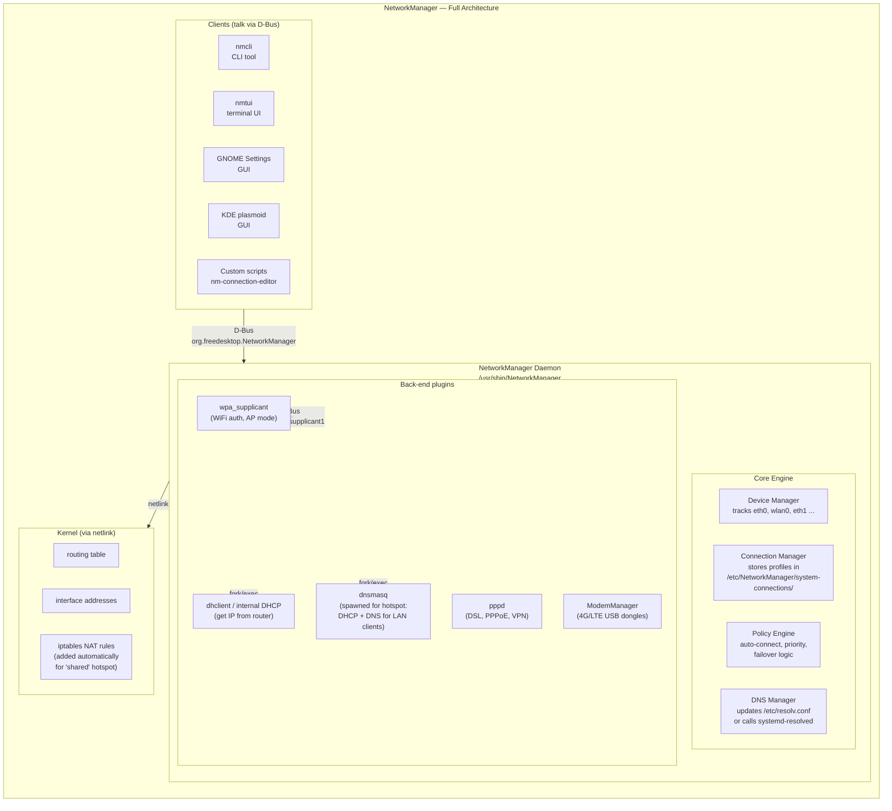

### Connection Profile Storage

Every saved network is a text file:

```
/etc/NetworkManager/system-connections/
├── PiFirewall-hotspot.nmconnection     ← our wlan0 AP
├── WAN-eth0.nmconnection               ← DHCP from router
└── LAN-eth1.nmconnection               ← static 10.42.0.1/24

Example: PiFirewall-hotspot.nmconnection
─────────────────────────────────────────────────
[connection]
id=PiFirewall-hotspot
type=wifi
interface-name=wlan0
autoconnect=true

[wifi]
mode=ap                  ← Access Point mode
ssid=PiFirewall
band=bg
channel=6

[wifi-security]
key-mgmt=wpa-psk
psk=YourPassword

[ipv4]
method=shared            ← NM spawns dnsmasq + adds iptables MASQUERADE
address1=10.42.0.1/24,10.42.0.1
─────────────────────────────────────────────────
```

When `method=shared`, NetworkManager **automatically**:
1. Starts `wpa_supplicant` in AP mode
2. Spawns a `dnsmasq` instance for DHCP + DNS
3. Adds `iptables MASQUERADE` on the WAN interface
4. Sets `net.ipv4.ip_forward=1`

This is the `--nm-hotspot` path in `pi4_gateway.sh`.

---

## 6. D-Bus: The Glue Nobody Talks About

D-Bus was created by the freedesktop.org project in 2002 (Havoc Pennington, Red Hat).
It is an IPC (inter-process communication) message bus. Every `nmcli` command you type
is translated into a D-Bus method call to the NetworkManager daemon.

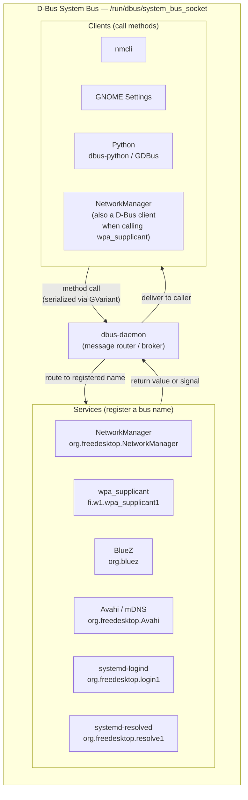

**What happens when `pi4_gateway.sh` creates a hotspot:**

```
nmcli con add type wifi mode ap ssid "PiFirewall" ...
  │
  └─► dbus-send to org.freedesktop.NetworkManager
           method: Settings.AddConnection
           args:   {connection profile as GVariant dict}
                │
                └─► NM daemon receives message
                     NM calls wpa_supplicant via D-Bus:
                       fi.w1.wpa_supplicant1.CreateInterface
                       fi.w1.wpa_supplicant1.Interface.AddNetwork
                     NM calls kernel via netlink:
                       ip addr add 10.42.0.1/24 dev wlan0
                       iptables -t nat -A POSTROUTING -o eth0 -j MASQUERADE
                     NM forks dnsmasq:
                       dnsmasq --interface=wlan0 --dhcp-range=10.42.0.10,10.42.0.200
```

---

## 7. systemd: The Great Unifier (2010)

Lennart Poettering and Kay Sievers at Red Hat announced systemd in January 2010.
It was one of the most controversial changes in Linux history — and one of the most impactful.

### What systemd Replaced

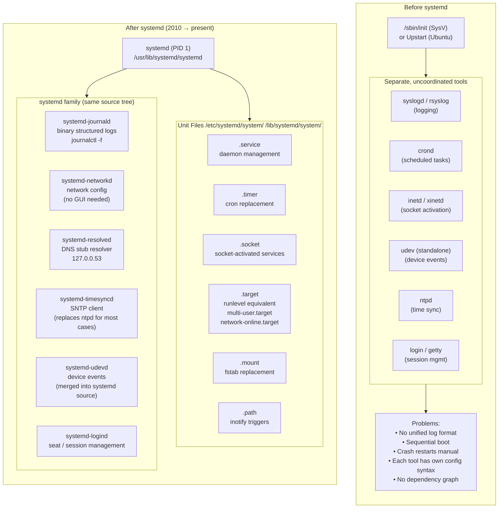

### Why systemd Won

| Feature | SysV init | systemd |
|---|---|---|
| Startup style | Sequential | Parallel (socket activation) |
| Dependency tracking | Manual `S##` numbering | `After=`, `Requires=`, `Wants=` |
| Crash recovery | Manual / external monit | Built-in `Restart=always` |
| Logging | syslog text files | journald (binary, indexed, structured) |
| Cgroups isolation | External | Automatic per-service |
| Typical boot time | 30–90 s | 3–8 s |
| Config syntax | Shell script | INI-style unit files |
| Adoption | 1992–2011 | 2011 → Fedora, 2015 → Debian/Ubuntu |

### The Unit File — Our Service Definition

Our blocker's unit file demonstrates all the critical directives:

```ini
# /etc/systemd/system/chromecast-blocker.service

[Unit]
Description=Chromecast Privacy Firewall
# ─────────────────────────────────────────────────────────────────────────
# After= means "start AFTER these, but do not require them"
# network-online.target is reached only when at least one interface has
# a routable IP address. Without this, our blocker would start before
# the network exists and its iptables rules would apply to interfaces
# that don't yet have addresses — silently doing nothing useful.
# ─────────────────────────────────────────────────────────────────────────
After=network-online.target NetworkManager.service
Wants=network-online.target

[Service]
Type=simple
ExecStart=/usr/bin/python3 /opt/chromecast_blocker/chromecast_blocker.py
# Restart on crash after 5 seconds — systemd watches the process
Restart=always
RestartSec=5
User=root

[Install]
# Enable means: add this to multi-user.target's dependency graph
# So it starts automatically on every boot in runlevel 3/5 equivalent
WantedBy=multi-user.target
```

### systemd Target Dependency Graph (simplified)

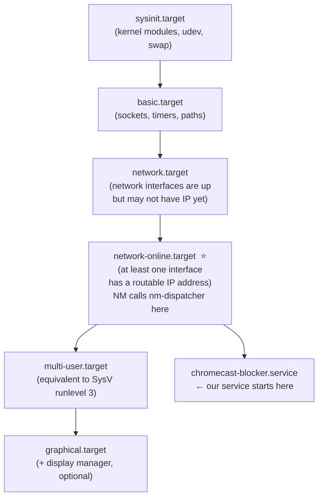

> **Critical:** `network.target` only means "NetworkManager has started."
> `network-online.target` means "an IP address exists." Always use the latter
> for services that open network sockets or install firewall rules.

---

## 8. systemd-networkd: The Leaner Alternative

`systemd-networkd` is part of the systemd family but does **not** ship with NetworkManager.
It is the right choice for headless servers, containers, and embedded systems (like our Pi in gateway mode).

### networkd vs NetworkManager Side-by-Side

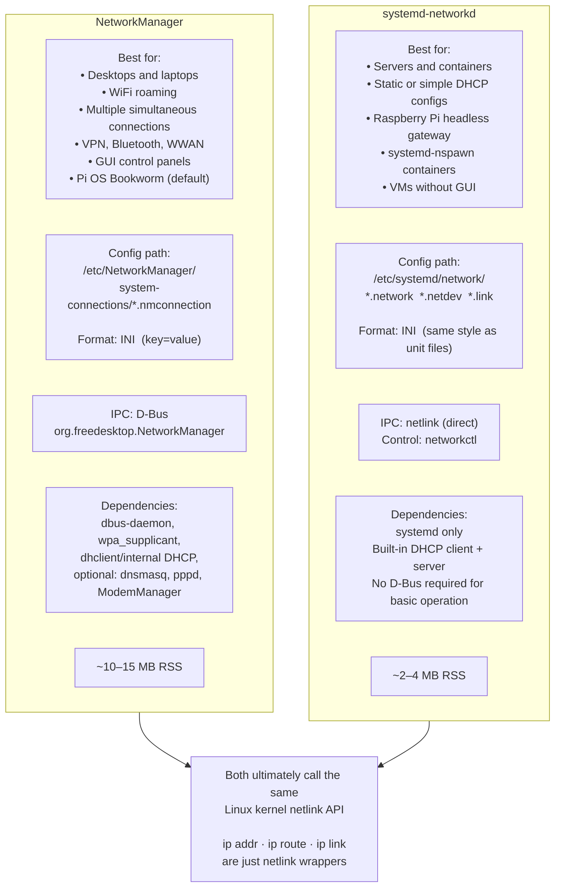

### systemd-networkd Configuration Example (our Pi in gateway mode)

```
/etc/systemd/network/
├── 10-wan.network      ← eth0: get IP from ISP router via DHCP
├── 20-lan.network      ← eth1: be the gateway for our LAN
└── 30-wifi-ap.netdev   ← wlan0: (if using networkd + hostapd instead of NM)

── 10-wan.network ──────────────────────────────────────
[Match]
Name=eth0

[Network]
DHCP=ipv4
IPForward=yes          ← enable kernel IP forwarding on this interface
────────────────────────────────────────────────────────

── 20-lan.network ──────────────────────────────────────
[Match]
Name=eth1

[Network]
Address=10.42.0.1/24
IPForward=yes
DHCPServer=yes         ← networkd has a built-in DHCP server

[DHCPServer]
PoolOffset=10
PoolSize=190
EmitDNS=yes
DNS=10.42.0.1
────────────────────────────────────────────────────────
```

Compare to NetworkManager's `method=shared` — same result, different syntax, no D-Bus.

---

## 9. Raspberry Pi OS: Which Stack Are You On?

Raspberry Pi OS has changed its default networking stack three times:

```
┌─────────────────────────────────────────────────────────────────────────┐
│  Pi OS Release      Default network stack             WiFi AP tool      │
├─────────────────────────────────────────────────────────────────────────┤
│  Stretch  (2017)    dhcpcd + wpa_supplicant            hostapd (manual)  │
│  Buster   (2019)    dhcpcd + wpa_supplicant            hostapd (manual)  │
│  Bullseye (2021)    dhcpcd + wpa_supplicant            hostapd (manual)  │
│  Bookworm (2023) ★  NetworkManager  ← YOU ARE HERE     nmcli con add ap  │
└─────────────────────────────────────────────────────────────────────────┘
★ Check your version: cat /etc/os-release | grep VERSION_CODENAME
```

### How `pi4_gateway.sh` Handles Both

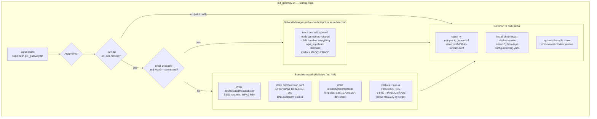

---

## 10. Boot Sequence: From Power-On to Protected

Understanding **when** each piece starts is essential. A firewall rule installed before
the interface exists is silently discarded.

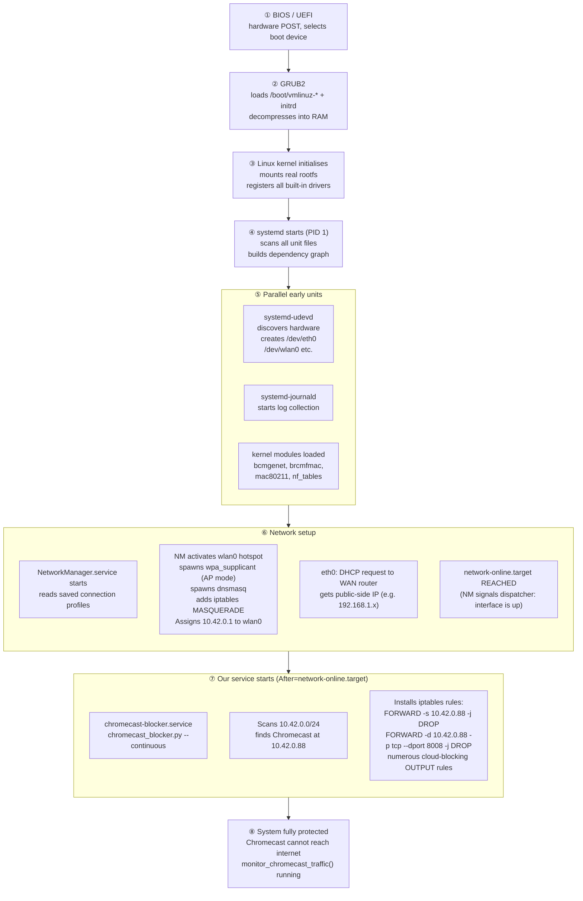

> **Race condition warning:** If you use `After=network.target` instead of
> `After=network-online.target`, your service starts the moment NetworkManager
> is running — before any IP address is assigned. Your blocker would start,
> find no interface matching `10.42.0.x`, and exit or do nothing.

---

## 11. mDNS, SSDP, Cast: Why Chromecast Is a Threat

Chromecast uses three protocols that, without a gateway firewall, are exploitable
from the internet if UPnP on your router opens ports, or from the local network.

```mermaid
graph TB
    subgraph THREATS["Chromecast Attack Surfaces"]
        direction TB

        subgraph MDNS_S["mDNS — Multicast DNS  RFC 6762"]
            MDNS_Q["Query  (small, ~40 bytes)\nwho is _googlecast._tcp.local?\nsent to 224.0.0.251:5353"]
            MDNS_A["Response  (large, 200–2000 bytes)\nbroadcast to all on subnet"]
            MDNS_RISK_D["DDoS amplification factor: ~10–50×\nAttacker spoofs victim's IP as source\n→ Chromecast floods victim with responses"]
        end

        subgraph SSDP_S["SSDP — Simple Service Discovery Protocol"]
            SSDP_Q["M-SEARCH * HTTP/1.1\nHost: 239.255.255.250:1900\n(small UDP packet)"]
            SSDP_A["HTTP/1.1 200 OK\n(unicast response with full device desc.)"]
            SSDP_RISK_D["DDoS amplification factor: 30–300×\nAlso used to enumerate UPnP services\n→ discover open ports → exploit router"]
        end

        subgraph CAST_S["Google Cast Protocol  TCP 8008 / 8009 / 8443"]
            CAST_CON["TCP connect to :8008\nJSON control channel\n(unencrypted on 8008)"]
            CAST_CMD["Any device on subnet can:\n• Start/stop casting\n• Read what is being cast\n• Inject malicious content\n• Crash the device"]
            CAST_RISK_D["Risk: privacy violation\neavesdropping on viewing habits\nphishing via display injection"]
        end

        subgraph CLOUD_S["Google Cloud Telemetry"]
            CLOUD_1["Connects to:\ngoogleapis.com\ngooglecast.com\nfirebase.googleapis.com\nmetrics.gstatic.com"]
            CLOUD_RISK_D["Sends:\n• Voice snippets (Ambient Mode)\n• Viewing history\n• App usage telemetry\n• Location data\n• Wi-Fi scan results"]
        end
    end

    subgraph BLOCKS["Our iptables blocks"]
        direction LR
        B1["DROP udp --dport 5353\n(mDNS from WAN)"]
        B2["DROP udp --dport 1900\n(SSDP from WAN)"]
        B3["DROP tcp --dport 8008:8009\n(Cast from WAN)"]
        B4["FORWARD DROP\n-s 10.42.0.88 -o eth0\n(all outbound from Chromecast)"]
        B5["OUTPUT rate-limit\n-d googleapis.com\n-p tcp --dport 443"]
    end

    MDNS_RISK_D --> B1
    SSDP_RISK_D --> B2
    CAST_RISK_D --> B3
    CLOUD_RISK_D --> B4
    CLOUD_RISK_D --> B5
```

---

## 12. Historical Timeline

```mermaid
graph TB
    subgraph TIMELINE["Linux Networking — 30 Years of Evolution"]
        direction TB

        Y91["1991\nLinux 0.1 released (Linus Torvalds)\nNo network stack yet"]
        Y93["1993\nLinux 0.99 — first TCP/IP stack\nBSD socket API adopted"]
        Y94["1994\nipfwadm — first Linux firewall tool\n(ported from BSD ipfw)"]
        Y97["1997\nipchains replaces ipfwadm\nLinux 2.1.x"]
        Y98["1998\nifupdown (Debian) stabilises\n/etc/network/interfaces becomes standard"]
        Y99["1999\nipchains → Netfilter merged into Linux 2.3\nRusty Russell writes Netfilter framework\niptables 1.0 released\nnetlink socket API matures"]
        Y00["2000\nLinux 2.4 released\nNetfilter officially part of kernel\niptables replaces ipchains\nSysV init still dominant"]
        Y02["2002\nD-Bus created by Havoc Pennington (Red Hat)\nfreedesktop.org project"]
        Y04["2004\nNetworkManager 0.1 (Robert Love, Red Hat)\nGoal: WiFi roaming on laptops\nwpa_supplicant 0.2 released"]
        Y06["2006\nNetworkManager 0.6 — first stable release\nUbuntu 6.10 ships NM by default\nD-Bus becomes the NM control interface"]
        Y08["2008\nAndroid uses Linux kernel with custom network stack\niproute2 replaces net-tools (ifconfig, route, netstat)"]
        Y10["2010\nsystemd announced by Lennart Poettering & Kay Sievers\nFedora 15 adopts systemd (2011)\nParallel boot, unit files, journald"]
        Y12["2012\nsystemd-networkd introduced\nsystemd-resolved introduced\nnftables development begins (replaces iptables long-term)"]
        Y14["2014\nDebian 8 (Jessie) adopts systemd\nnftables merged into Linux 3.13"]
        Y15["2015\nUbuntu 15.04 adopts systemd\nNetwork Management becomes: NM or networkd (choose one)"]
        Y17["2017\nUbuntu 17.10 introduces Netplan\n(YAML frontend → generates NM or networkd config)\nnftables kernel-ready, iptables becomes legacy wrapper"]
        Y19["2019\nRaspberry Pi OS Buster\nstill uses dhcpcd + wpa_supplicant (no NM)"]
        Y21["2021\nRaspberry Pi OS Bullseye\nstill dhcpcd — NM optional via raspi-config"]
        Y23["2023\nRaspberry Pi OS Bookworm\nNetworkManager is now DEFAULT on Pi\nThis project fully supports both paths"]
        Y24["2024–2026\nThis project: Pi 4 privacy gateway\nchromecast_blocker.py + pi4_gateway.sh\niptables firewall + NM hotspot\n10.42.0.88 = Chromecast, permanently blocked"]

        Y91 --> Y93 --> Y94 --> Y97 --> Y98 --> Y99 --> Y00
        Y00 --> Y02 --> Y04 --> Y06 --> Y08 --> Y10
        Y10 --> Y12 --> Y14 --> Y15 --> Y17 --> Y19
        Y19 --> Y21 --> Y23 --> Y24
    end
```

---

## Quick-Reference: Commands That Show the Stack

```bash
# ── What network stack is running? ───────────────────────────────────────
systemctl status NetworkManager          # Is NM running?
systemctl status systemd-networkd        # Is networkd running?
nmcli dev status                         # NM device view
networkctl status                        # networkd device view

# ── See the kernel's view (same regardless of user-space stack) ──────────
ip addr show                             # All interfaces + addresses
ip route show                            # Routing table
ip neigh show                            # ARP table
cat /proc/sys/net/ipv4/ip_forward        # Is IP forwarding on?

# ── See the firewall (our rules live here) ────────────────────────────────
iptables -L -n -v --line-numbers         # filter table
iptables -t nat -L -n -v                 # nat table (MASQUERADE)
iptables -t mangle -L -n -v             # mangle table

# ── systemd service management ───────────────────────────────────────────
systemctl status chromecast-blocker      # Is our blocker running?
journalctl -u chromecast-blocker -f      # Live blocker logs
systemctl list-dependencies network-online.target  # What depends on network?

# ── D-Bus inspection ─────────────────────────────────────────────────────
busctl tree org.freedesktop.NetworkManager   # NM D-Bus object tree
busctl monitor org.freedesktop.NetworkManager  # Watch NM D-Bus traffic live
```

---

## Further Reading

| Topic | Resource |
|---|---|
| Netfilter internals | `man iptables-extensions`, `man netfilter` |
| NetworkManager D-Bus API | `man NetworkManager`, `/usr/share/doc/network-manager/` |
| systemd unit files | `man systemd.service`, `man systemd.network` |
| netlink programming | `man 7 netlink`, `man 7 rtnetlink` |
| iproute2 | `man ip`, `man ip-route`, `man ip-address` |
| Raspberry Pi OS networking | `/boot/firmware/cmdline.txt`, `raspi-config` |
| This project | [README.md](README.md), [PI4_SETUP.md](PI4_SETUP.md), [ARCHITECTURE.md](ARCHITECTURE.md) |

---

## Chapter 13: The AI Watchdog Layer — Adding Intelligence on Top

After understanding the full networking stack, this chapter explains **why** a purely
rule-based firewall is not enough, and **how** the AI watchdog layer fills the gap.

### The Limits of Passive Firewalling

```
A static iptables ruleset is like a lock on a door.
It stops known threats.  It cannot:
  • Detect a new attack pattern it has never seen
  • Correlate events across time (scan now, exploit later)
  • Recognise when multiple attack vectors come from the same source
  • Communicate urgency to a human operator
  • Adapt: a determined attacker rotates IPs, tries slow scans below thresholds
```

### The AI Watchdog Pipeline

```mermaid
graph TB
    subgraph EVENTS["Raw event streams"]
        direction LR
        A1["iptables LOG lines\n(FW-NULLSCAN, FW-SYNFLOOD, …)"]
        A2["SSH auth failures\n(/var/log/auth.log or journald)"]
        A3["ARP table changes\n(/proc/net/arp)"]
        A4["Service health\n(systemd unit state)"]
    end

    subgraph WATCHDOG["pi_watchdog.py — existing rule-based layer"]
        direction TB
        B1["Per-IP event counters\nsliding time windows"]
        B2["Threshold → IPBlocker.block(ip)\niptables -I INPUT -s ip -j DROP"]
        B3["Log to watchdog.log\nStructured: [TAG] eid=... src=... type=..."]
    end

    subgraph AI["AIAnalyser — added intelligence layer"]
        direction TB

        C1["tail -n 200 watchdog.log\nevery 30 seconds"]
        C2["Parse structured log lines\nextract: eid, src, cat, type, rdns"]
        C3["Deduplicate by eid\nnever score same event twice"]

        subgraph SCORING["Rule-based threat scoring"]
            S1["Per-IP score accumulation\nARP-SPOOF +8\nport scan  +3\nSSH-FAIL   +2\nflood      +3-4"]
            S2["Coordination bonus +3\nif same IP appears in ≥3 attack categories\n← this is the key insight:\n  one scanner is annoying\n  one IP doing ARP + SSH + portscan\n  = targeted, coordinated attack"]
        end

        subgraph LLM_OPT["Optional: LLM classification\n(ollama, local, no internet needed)"]
            L1["Format last 20 events\nas structured prompt"]
            L2["POST to /api/generate\n(phi3:mini or llama3.2:1b\nrun locally on Pi 4 — 4GB RAM needed)"]
            L3["Parse JSON response\n{level: CRITICAL, reason: ...}\nCan only upgrade score, never downgrade"]
        end

        C1 --> C2 --> C3 --> SCORING --> LLM_OPT
    end

    subgraph LEVELS["Threat Level Decision"]
        direction LR
        D1["NORMAL   (0–2)\nno action"]
        D2["SUSPICIOUS (3–5)\nnotify operator"]
        D3["CRITICAL   (6–9)\nnotify operator + increase vigilance"]
        D4["FATAL      (≥10)\nnotify + Emergency Lockdown"]
    end

    subgraph RESPONSE["Response"]
        direction TB
        E1["NotificationManager\n• wall broadcast\n• ai_alerts.json (web UI polls)\n• FATAL_ALERT file\n• journald CRITICAL entry"]
        E2["EmergencyShutdown  (FATAL only)\niptables -P FORWARD DROP\niptables -F FORWARD\nnat -F POSTROUTING\nsysctl ip_forward=0\nip link set eth0 down\nWrite LOCKDOWN_ACTIVE"]
        E3["Restore path\npi_watchdog.py --clear-lockdown\nRestores FORWARD=ACCEPT\nip_forward=1\neth0 up"]
    end

    EVENTS --> WATCHDOG --> AI --> LEVELS
    LEVELS -->|"SUSPICIOUS/CRITICAL/FATAL"| E1
    LEVELS -->|"FATAL only"| E2
    E2 -.->|"manual recovery"| E3
```

### Why Local LLM?

Running a small language model locally on the Pi 4 (or a separate machine on the LAN)
avoids sending security logs to a cloud API, which would itself be a privacy violation.

```
Model options for a Pi 4 (4 GB RAM):
  phi3:mini       ~2.3 GB  — Microsoft, good at structured tasks
  llama3.2:1b     ~1.3 GB  — Meta, fastest
  gemma2:2b       ~1.6 GB  — Google, good reasoning

Install ollama:
  curl -fsSL https://ollama.com/install.sh | sh
  ollama pull phi3:mini

Then start watchdog with:
  sudo python3 pi_watchdog.py --llm-endpoint http://localhost:11434
```

The LLM sees only the structured log excerpt — no packet payloads, no personal data.
It acts as a second opinion: the rule-based score is always computed first and the LLM
can only **escalate** a decision, never reduce it.

### The Coordination Bonus — The Key Algorithmic Insight

```
Traditional IDS:  counts events per type, per IP, in a time window
                  Attacker evades by staying below thresholds

AIAnalyser:       counts DISTINCT attack types per IP
                  Three different attack types from one IP = +3 bonus
                  A targeted adversary trying multiple vectors is more dangerous
                  than a scanner hitting one type hundreds of times

Example:
  IP 1.2.3.4 sends:
    1× FW-NULLSCAN  = +3
    1× SSH-FAIL     = +2
    1× ARP-SPOOF    = +8  ← likely spoofed by someone physically on network
    coordination    = +3
    ─────────────────────
    TOTAL           = 16  → FATAL → Emergency lockdown triggered
```

### Emergency Lockdown — What Exactly Stops

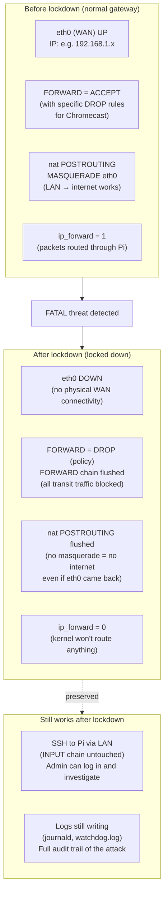

